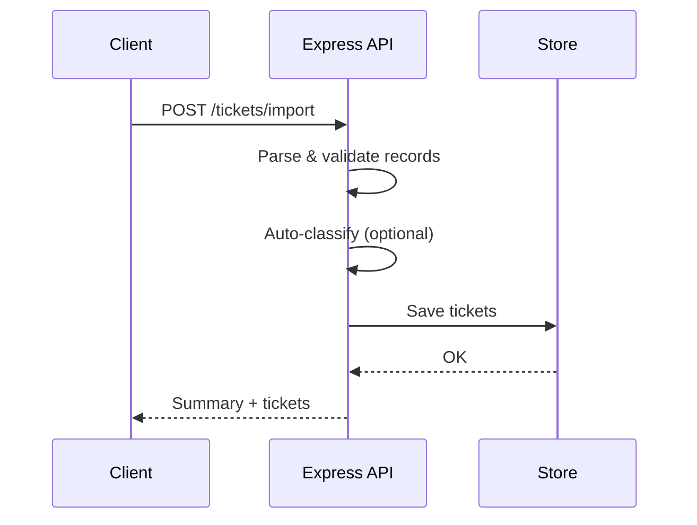

# API Reference

Comprehensive reference for API consumers.

## Data Model

Ticket schema fields:
- id: UUID
- customer_id: string
- customer_email: email
- customer_name: string
- subject: string (1-200)
- description: string (10-2000)
- category: account_access | technical_issue | billing_question | feature_request | bug_report | other
- priority: urgent | high | medium | low
- status: new | in_progress | waiting_customer | resolved | closed
- created_at: ISO datetime
- updated_at: ISO datetime
- resolved_at: ISO datetime (nullable)
- assigned_to: string (nullable)
- tags: array of strings
- metadata: { source: web_form | email | api | chat | phone, browser: string, device_type: desktop | mobile | tablet }
- classification_confidence: number (0-1)

## Endpoints

### POST /tickets
Create a new ticket.

Request body:
```json
{
  "customer_id": "C001",
  "customer_email": "user@example.com",
  "customer_name": "User",
  "subject": "Login issue",
  "description": "Cannot login due to 2FA.",
  "category": "other",
  "priority": "medium",
  "status": "new",
  "metadata": { "source": "api", "browser": "Chrome", "device_type": "desktop" },
  "auto_classify": true
}
```

Response (201): ticket object.

### POST /tickets/import
Bulk import tickets.

Request body:
```json
{ "format": "csv|json|xml", "content": "<raw string>", "auto_classify": true }
```

Response (201):
```json
{ "summary": { "total": 50, "successful": 48, "failed": 2, "errors": [{"index": 1, "message": "Validation failed", "details": ["..."]}] }, "tickets": [ /* saved tickets */ ] }
```

### GET /tickets
List tickets with optional filters: `category`, `priority`, `status`, `tags` (comma-separated), `search`.

### GET /tickets/:id
Return the specified ticket or 404 if not found.

### PUT /tickets/:id
Update fields; validates merged ticket. Response 200 with updated ticket or 404.

### DELETE /tickets/:id
Delete ticket. Response 204 or 404.

### POST /tickets/:id/auto-classify
Run auto-classification. Response includes:
```json
{ "id": "...", "category": "technical_issue", "priority": "urgent", "confidence": 0.8, "reasoning": "...", "keywords_found": ["critical", "crash"] }
```

## Error Responses

Format:
```json
{ "error": "Message", "details": ["...optional details..."] }
```

## cURL Examples

```bash
# Create ticket
curl -X POST http://localhost:3000/tickets \
  -H 'Content-Type: application/json' \
  -d '{"customer_id":"C1","customer_email":"c1@example.com","customer_name":"C1","subject":"Login","description":"Cannot login","category":"other","priority":"medium","status":"new","metadata":{"source":"api","device_type":"desktop"},"auto_classify":true}'

# Bulk import JSON
curl -X POST http://localhost:3000/tickets/import \
  -H 'Content-Type: application/json' \
  -d '{"format":"json","content":"[{\"customer_id\":\"J1\",\"customer_email\":\"j1@example.com\",\"customer_name\":\"J1\",\"subject\":\"S\",\"description\":\"Valid description\",\"metadata\":{\"source\":\"api\",\"device_type\":\"desktop\"}}]","auto_classify":true}'

# Auto-classify
curl -X POST http://localhost:3000/tickets/<id>/auto-classify
```

## Diagram



---
Authored using AI model: Claude (API Consumers)
