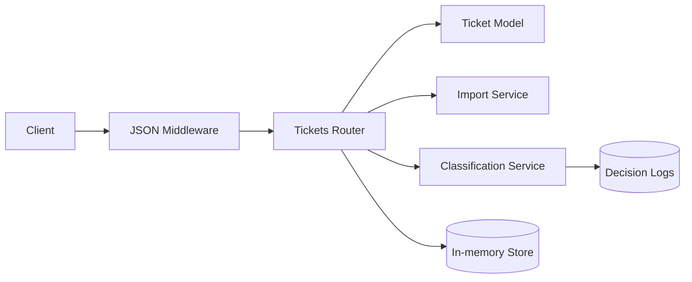
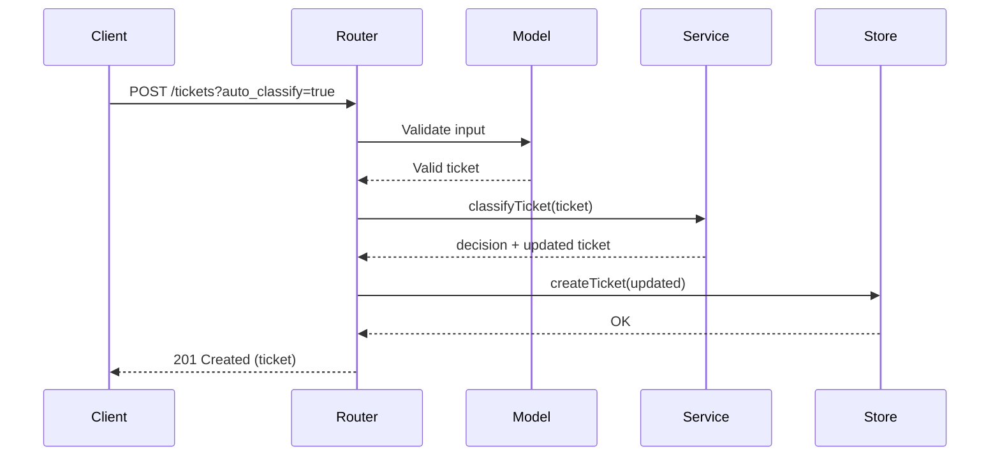

# Architecture

High-level design of the Support Ticket System.

## Overview

Components:
- Express API: handles HTTP requests and error responses
- Tickets Router: REST endpoints, filtering, and orchestration
- Ticket Model: validation via Joi
- Import Service: CSV/JSON/XML parsing and normalization
- Classification Service: rule-based categorization and priority
- In-memory Store: tickets and decision logs (replaceable with DB)

## Diagram

## Data Flow (Auto-Classification)

## Design Decisions & Trade-offs
- In-memory store: rapid iteration; production usage would swap with persistent DB
- Rule-based classification: deterministic, transparent, no external ML dependency
- Import via raw content: simplifies testing without multipart handling
- Validation via Joi: clear constraints and error messages

## Security Considerations
- Input validation on all endpoints
- Reject malformed files with detailed errors
- No file system writes during API operations
- Avoids executing user-supplied code

## Performance Considerations
- In-memory operations are fast; filters are O(n) over dataset
- CSV/JSON/XML parsing uses efficient libraries
- Simple thresholds validated via performance tests

---
Authored using AI model: Llama (Technical Leads)
