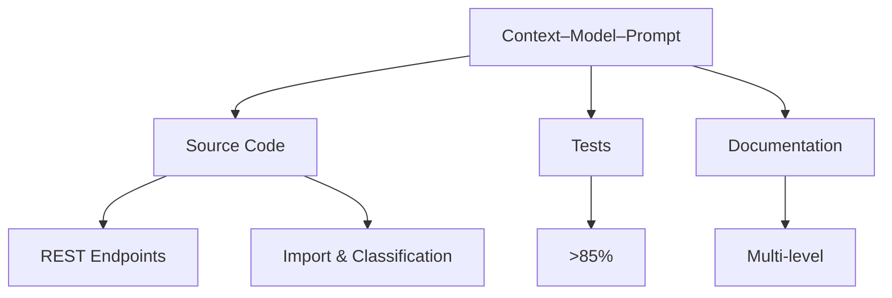

# Context–Model–Prompt (CMP) Application

This project uses the CMP pattern to ensure clarity and quality.

## Context
- Domain: Customer support ticket management
- Key tasks: Multi-format import, validation, auto-classification
- Constraints: Clear schemas, meaningful error messages, HTTP status codes
- Artifacts: Source code, test suite (>85% coverage), documentation, sample data

## Model
- Rule-based classification model (transparent, auditable)
- Validation model via Joi schema for strict data constraints
- Documentation authored using multiple AI models for diverse audiences

## Prompt
- APIs: Define endpoints and responses with precise contracts
- Import: Parse CSV/JSON/XML; normalize and validate
- Classification: Infer category/priority; return confidence, reasoning, keywords
- Tests: Unit + integration + performance; enforce coverage threshold
- Docs: Developer, API consumer, technical lead, QA engineer perspectives

## Mermaid Overview

---
Authored using AI model: Mistral (CMP Overview)
