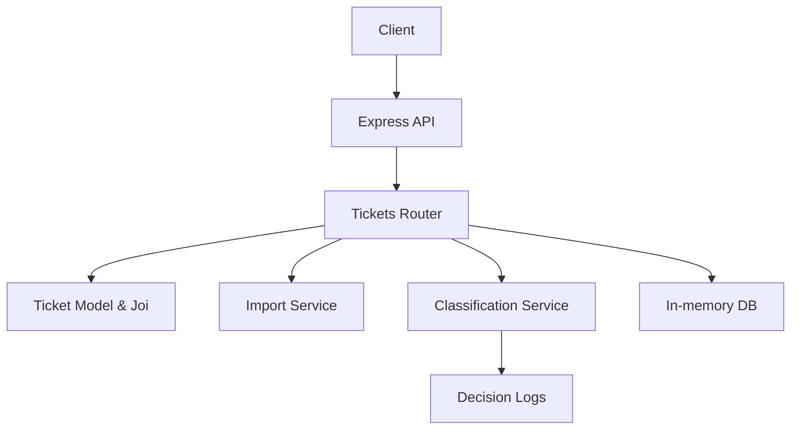

# Support Ticket System (Node.js/Express)

Project overview: multi-format ticket import (CSV/JSON/XML), automatic categorization and priority assignment, REST API, comprehensive tests (>85% coverage), and multi-level documentation.

## Solution & Approach
- Context–Model–Prompt (CMP):
  - Context: Support tickets with strict schema and clear error handling
  - Model: Deterministic rule-based classifier and Joi validation schema
  - Prompt: Clear API contracts, import normalization, decision logging, and coverage target
- Import: Normalize CSV/JSON/XML into a common shape, validate with Joi, return summary (`total/successful/failed/errors`)
- Classification: Keyword rules infer `category` and `priority`; returns `confidence`, `reasoning`, `keywords_found`; decisions logged
- Data store: In-memory for speed; replaceable with a DB without changing API contracts
- Testing: Jest + Supertest; unit + API + import parsers + integration + performance; verified >94% coverage

## AI Tools Used
- Code and tests: GPT-5 assisted scaffolding, API, services, and suites
- Documentation: Mixed models per audience — Claude (API Reference), Llama (Architecture), Gemini (Testing Guide), Mistral (CMP Overview)

See HOWTORUN: [homework-2/HOWTORUN.md](homework-2/HOWTORUN.md) for step-by-step run instructions.

## Features
- RESTful API for tickets (CRUD, filtering)
- Bulk import from CSV/JSON/XML with validation and summary
- Auto-classification with confidence, reasoning, keywords
- In-memory datastore for simplicity, easily swappable
- Jest + Supertest tests with coverage

## Architecture



## Installation & Setup

```bash
cd homework-2
npm install
npm run dev
```

Server runs on port 3000 by default.

## Run Tests

```bash
cd homework-2
npm test
```

Coverage report generated in `homework-2/coverage`.

## Project Structure

```
homework-2/
  src/
    app.js
    server.js
    db/memory.js
    models/ticket.js
    routes/tickets.js
    services/
      importService.js
      classificationService.js
  tests/
    *.test.js
    fixtures/
      sample_tickets.csv
      sample_tickets.json
      sample_tickets.xml
      invalid.*
  README.md
  API_REFERENCE.md
  ARCHITECTURE.md
  TESTING_GUIDE.md
  CONTEXT_MODEL_PROMPT.md
```

---
Authored using AI model: GPT-5 (Developers)
