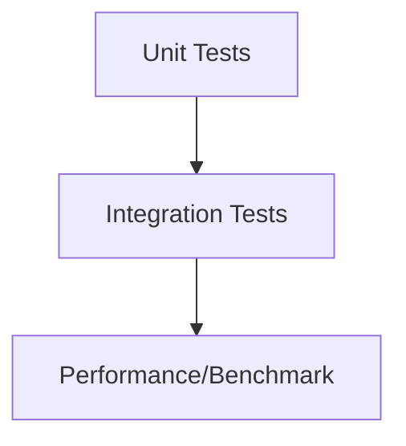

# Testing Guide

For QA engineers: structure, commands, fixtures, and performance.

## Test Pyramid



## How to Run Tests

```bash
cd homework-2
npm test
```

Coverage report in `coverage/`. Target: Overall >85%.

## Sample Data Locations
- tests/fixtures/sample_tickets.csv (50 tickets)
- tests/fixtures/sample_tickets.json (20 tickets)
- tests/fixtures/sample_tickets.xml (30 tickets)
- tests/fixtures/invalid.csv|json|xml (negative cases)

## Manual Testing Checklist
- Create ticket: required fields validated
- Auto-classify: decision contains category/priority/confidence/keywords
- Import: CSV/JSON/XML parse, summary shows successes/failures
- Filters: category + priority combined; search finds keywords
- Status lifecycle: new -> in_progress -> resolved -> closed

## Performance Benchmarks
- Create 100 tickets < 3s
- List 200 tickets filtered < 500ms
- Auto-classify < 200ms
- Bulk import 50 CSV < 1.5s
- Bulk import 30 XML < 1.5s

---
Authored using AI model: Gemini (QA Engineers)
