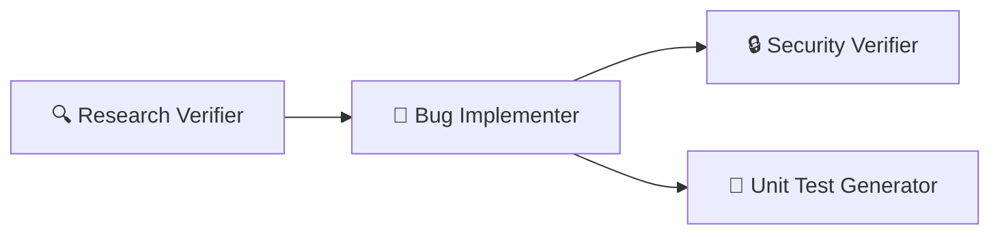

# 🤖 4-Agent Bug Fix Pipeline

A multi-agent system for automated bug fixing with verification, security analysis, and test generation.

## 📋 Overview

This project implements a 4-agent pipeline that automates the bug fixing process:



Each agent has a specific role in the pipeline:

| Agent | Role | Output |
|-------|------|--------|
| **Research Verifier** | Fact-checks bug research | `verified-research.md` |
| **Bug Implementer** | Applies code fixes | `fix-summary.md` |
| **Security Verifier** | Reviews for vulnerabilities | `security-report.md` |
| **Unit Test Generator** | Creates and runs tests | `test-report.md` |

## 🚀 Quick Start

```bash
# 1. Install dependencies
cd demo-bug-fix && npm install

# 2. Run the application
npm start

# 3. Run tests
npm test
```

## 📁 Project Structure

```
homework-4/
├── .github/agents/           # Agent definitions
│   ├── research-verifier.agent.md
│   ├── bug-implementer.agent.md
│   ├── security-verifier.agent.md
│   ├── unit-test-generator.agent.md
│   └── bug-fix-orchestrator.agent.md
├── skills/                   # Agent skills
│   ├── research-quality-measurement.md
│   └── unit-tests-FIRST.md
├── demo-bug-fix/             # Demo application
│   ├── src/
│   │   ├── controllers/
│   │   └── routes/
│   ├── tests/
│   ├── bugs/API-404/         # Bug context & outputs
│   │   ├── bug-context.md
│   │   ├── research/
│   │   │   ├── codebase-research.md
│   │   │   └── verified-research.md
│   │   ├── implementation-plan.md
│   │   ├── fix-summary.md
│   │   ├── security-report.md
│   │   └── test-report.md
│   └── package.json
├── docs/screenshots/         # Pipeline screenshots
├── README.md
├── HOWTORUN.md
└── STUDENT.md
```

## 🔧 Agents

### 1. Research Verifier
- **File**: `.github/agents/research-verifier.agent.md`
- **Skill**: `skills/research-quality-measurement.md`
- **Purpose**: Validates bug research accuracy
- **Output**: Quality rating (EXCELLENT → REJECTED)

### 2. Bug Implementer
- **File**: `.github/agents/bug-implementer.agent.md`
- **Purpose**: Applies fixes from implementation plan
- **Output**: Change documentation with before/after code

### 3. Security Verifier
- **File**: `.github/agents/security-verifier.agent.md`
- **Purpose**: Scans for security vulnerabilities
- **Output**: Findings rated CRITICAL → INFO

### 4. Unit Test Generator
- **File**: `.github/agents/unit-test-generator.agent.md`
- **Skill**: `skills/unit-tests-FIRST.md`
- **Purpose**: Generates tests following FIRST principles
- **Output**: Test files and execution report

### 5. Orchestrator (Bonus)
- **File**: `.github/agents/bug-fix-orchestrator.agent.md`
- **Purpose**: Coordinates all agents in sequence

## 🐛 Demo Bug Fix: API-404

### Bug Description
`GET /api/users/:id` returns 404 for valid user IDs due to type mismatch (string vs number comparison).

### Fix Applied
```javascript
// Before (bug)
const userId = req.params.id;  // string

// After (fix)
const userId = parseInt(req.params.id, 10);  // number
```

### Results

| Agent | Status | Key Findings |
|-------|--------|--------------|
| Research Verifier | ✅ PASS | Quality: EXCELLENT (100%) |
| Bug Implementer | ✅ SUCCESS | 1 change, 5 tests pass |
| Security Verifier | ✅ APPROVED | 0 critical, 1 medium |
| Unit Test Generator | ✅ PASS | 13 tests, FIRST ⭐⭐⭐⭐⭐ |

## 🛠️ Skills

### Research Quality Measurement
5-tier quality system:
- 🟢 EXCELLENT (95-100%)
- 🟡 GOOD (80-94%)
- 🟠 ACCEPTABLE (60-79%)
- 🔴 POOR (40-59%)
- ⛔ REJECTED (<40%)

### FIRST Principles
- **F**ast: < 100ms per test
- **I**ndependent: No shared state
- **R**epeatable: Deterministic results
- **S**elf-validating: Clear assertions
- **T**imely: Written with fix

## 📖 Documentation

- [HOWTORUN.md](HOWTORUN.md) - Detailed execution instructions
- [STUDENT.md](STUDENT.md) - Student information

## 📸 Screenshots

Screenshots of pipeline execution are in `docs/screenshots/`:
- Pipeline run
- Bug fix applied
- Security scan results
- Unit test results

## 🧪 Running Tests

```bash
cd demo-bug-fix
npm test
```

Expected output:
```
 PASS  tests/userController.test.js
  ✓ 13 tests passed
  Time: 0.271s
```

## 📝 License

MIT
